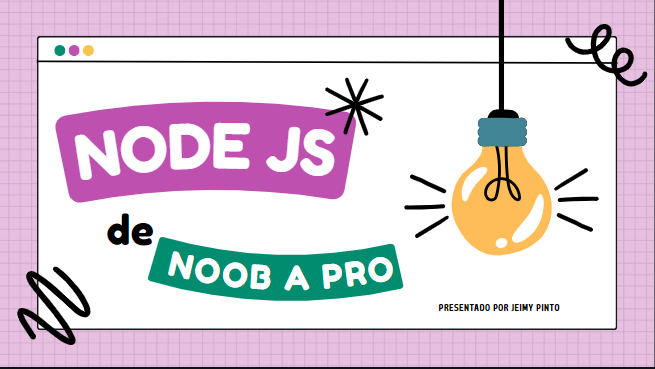

# Introducción a Node.js

Este es un proyecto introductorio a Node.js diseñado para ayudarte a aprender los conceptos básicos de esta poderosa plataforma de desarrollo JavaScript.

## Descripción

Node.js es un entorno de tiempo de ejecución de JavaScript que te permite ejecutar código JavaScript en el lado del servidor. En este proyecto, exploraremos las características clave de Node.js y cómo puedes utilizarlo para crear aplicaciones web, servidores, aplicaciones de línea de comandos y más.

[Descargar Presentación en PDF](recursos/presentacion.pdf)

## Contenido

- [Requisitos](#requisitos)
- [Configuración del Entorno](#configuración-del-entorno)
- [Instalación](#instalación)
- [Descargar el Script de la Base de Datos](#descargar-el-script-de-la-base-de-datos)
- [Licencia](#licencia)

## Requisitos

Antes de comenzar, asegúrate de tener instalado lo siguiente:

- Node.js: Descárgalo desde [nodejs.org](https://nodejs.org/)
- MySQL: Asegúrate de tener MySQL instalado en tu sistema. Si no lo tienes instalado, sigue estos pasos:

  - **Windows:**
    1. Descarga el instalador de MySQL desde [MySQL Downloads](https://dev.mysql.com/downloads/installer/).
    2. Sigue las instrucciones del instalador para configurar MySQL en tu sistema.

  - **macOS:**
    1. Puedes instalar MySQL utilizando [Homebrew](https://brew.sh/). Ejecuta el siguiente comando:
    ```bash
    brew install mysql
    ```
    2. Sigue las instrucciones de Homebrew para completar la instalación.

  - **Linux:**
    1. En la mayoría de las distribuciones de Linux, puedes instalar MySQL utilizando el gestor de paquetes. Por ejemplo, en Ubuntu, puedes ejecutar:
    ```bash
    sudo apt-get update
    sudo apt-get install mysql-server
    ```
    2. Sigue las instrucciones del sistema para completar la instalación.

  - **Verificación de la instalación:**
    Para verificar que MySQL se ha instalado correctamente, puedes abrir una terminal y ejecutar el comando `mysql -V`. Debería mostrar la versión de MySQL.

## Configuración del Entorno

Antes de comenzar a trabajar con este proyecto, asegúrate de configurar adecuadamente tu entorno de desarrollo. Sigue estos pasos:

### 1. Instalar XAMPP

- **Windows:**
  1. Descarga el instalador de XAMPP desde [el sitio web oficial de XAMPP](https://www.apachefriends.org/index.html).
  2. Ejecuta el instalador y sigue las instrucciones para completar la instalación de XAMPP.

- **macOS:**
  1. Descarga la versión de XAMPP para macOS desde [el sitio web oficial de XAMPP](https://www.apachefriends.org/index.html).
  2. Abre el archivo DMG descargado y arrastra la aplicación XAMPP a la carpeta de Aplicaciones.
  3. Inicia XAMPP desde la carpeta de Aplicaciones.

- **Linux:**
  1. Puedes instalar XAMPP en Linux siguiendo las instrucciones en la [página de descarga de XAMPP para Linux](https://www.apachefriends.org/download.html).
  2. Asegúrate de seguir las instrucciones específicas para tu distribución de Linux.

### 2. Configurar MySQL en XAMPP

- Abre XAMPP y asegúrate de que el módulo MySQL esté activado en el panel de control de XAMPP.

- Accede a phpMyAdmin a través de la interfaz web de XAMPP para administrar tu base de datos MySQL.

Con XAMPP y MySQL configurados en tu entorno, estarás listo para trabajar con este proyecto. Sigue las instrucciones de [instalación](#instalación)  y ejecución en la sección correspondiente para comenzar.


## Instalación

Para ejecutar este proyecto en tu entorno de desarrollo, sigue estos pasos:

1. **Clona este repositorio** en tu máquina local:

   ```bash
   git clone https://github.com/ADSO-2613934/Introduccion-a-NodeJS
   cd Introduccion-a-NodeJS

## Descargar el Script de la Base de Datos

Puedes descargar el script de la base de datos en formato SQL desde el siguiente enlace:

[Descargar bbdd.sql](./assets/bbdd.sql)